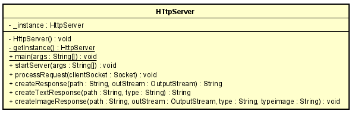

# TALLER DE ARQUITECTURAS DE SERVIDORES DE APLICACIONES, META PROTOCOLOS DE OBJETOS, PATRÓN IOC, REFLEXIÓN
### Daniel Santiago Ducuara Ardila
### 14/09/2021

## DESCRIPCIÓN
Para este taller los estudiantes deberán construir un servidor Web (tipo Apache) en Java. El servidor debe ser capaz de entregar páginas html e imágenes tipo PNG. Igualmente el servidor debe proveer un framework IoC para la construcción de aplicaciones web a partir de POJOS. Usando el servidor se debe construir una aplicación Web de ejemplo y desplegarlo en Heroku. El servidor debe atender múltiples solicitudes no concurrentes.

Para este taller desarrolle un prototipo mínimo que demuestre capcidades reflexivas de JAVA y permita por lo menos cargar un bean (POJO) y derivar una aplicación Web a partir de él. Debe entregar su trabajo al final del laboratorio.

## Diagrama de clases

### Paquete HttpServer
 
El paquete HttpServer se encarga de crear un servidor que soporte múltiples solicitudes, la clase cuenta con métodos como startServer en el cual se inicia la conexión 
al servidor, en el método processRequest se crea la solicitud del servidor y en el método createTextResponse retorna la información del archivo html.
Para la ejecución es necesario iniciar el servidor y en el navegador colocar 127.0.0.1:35000/archivo, para la parte del archivo se encuentran 3 archivos en la 
carpeta TestHttpServer para probar con dichos archivos.

para ejecutar localmente http://127.0.0.1:35000/escuela.png si se desea cambiar de archivo debe reemplazar escuela.png por un archivo que se encuentre en la carpeta TestHttpServer.

